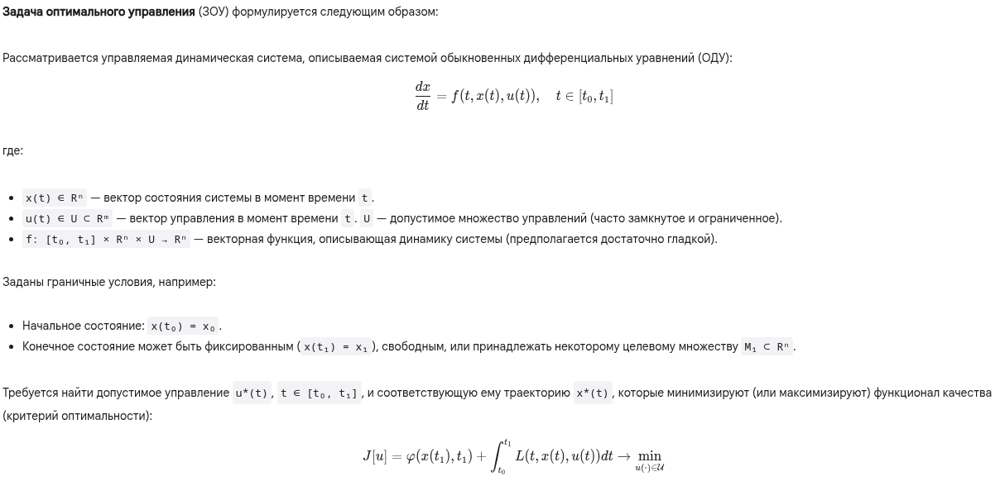
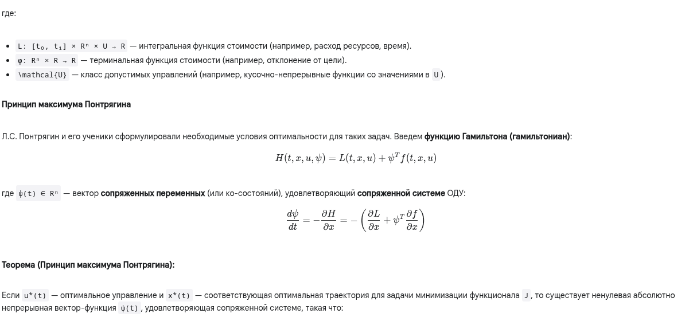
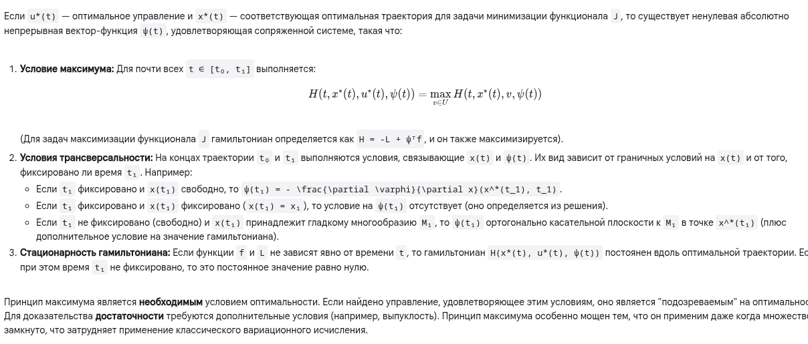

# 10. Задачи оптимального управления. Принцип максимума

## Краткий ответ

**Задачи оптимального управления** (ЗОУ) заключаются в поиске такой стратегии управления динамической системой, которая минимизирует (или максимизирует) заданный критерий качества (функционал) при выполнении ограничений на состояние системы и управление. 

**Принцип максимума Понтрягина** — это фундаментальное необходимое условие оптимальности в таких задачах, утверждающее, что оптимальное управление в каждый момент времени должно максимизировать специальную функцию — гамильтониан, построенный на основе уравнений системы, функционала качества и сопряженных переменных.

## Простыми словами

Представьте, что вы хотите проехать на машине из точки А в точку Б как можно быстрее (или потратив минимум бензина). Это задача оптимального управления.

- Система: Ваша машина.

- Состояние (x(t)): Положение машины, ее скорость в каждый момент времени t.

- Управление (u(t)): То, как вы жмете на газ или тормоз, как поворачиваете руль. У вас есть ограничения: нельзя нажать газ "ниже нуля" или "выше максимума", руль поворачивается на ограниченный угол. Это множество U.

- Правила движения (dx/dt = f(...)): Физические законы, которые говорят, как изменится положение и скорость машины в следующий момент в зависимости от текущего состояния и ваших действий (управления).

- Цель (функционал J): Минимизировать время в пути или расход бензина. Это может включать стоимость всего пути (интеграл L) и, возможно, "штраф" за то, насколько далеко от точки Б вы оказались в конце (терминальная часть φ).

- Граничные условия: Вы стартуете из точки А (x(t₀)=x₀) и хотите приехать в точку Б (x(t₁)=x₁).

Как найти оптимальный способ рулить и жать на педали (u*(t))? Просто "ехать вперед" может быть не лучшим решением, если нужно объезжать препятствия или экономить топливо.

**Принцип максимума Понтрягина** дает нам "проверочное правило", которое должно выполняться для самой лучшей стратегии. Он говорит:

1. Придумай "помощника" — Гамильтониан (H). Эта функция объединяет в себе:

- Мгновенную "стоимость" ваших действий (сколько бензина тратится прямо сейчас — L).

- Как ваши действия влияют на движение машины (f).

- Насколько важно сейчас изменить положение или скорость, чтобы достичь конечной цели наилучшим образом. Эту "важность" или "чувствительность" показывают специальные сопряженные переменные (ψ). Их можно представить как "теневые цены" или "оценки будущего влияния" текущего состояния. Они тоже меняются со временем по своим правилам (сопряженная система).

2. Правило максимума: В каждый момент времени ваша оптимальная стратегия (как нажать на газ/тормоз u*(t)) должна давать максимально возможное значение этому "помощнику"-гамильтониану H, по сравнению со всеми другими возможными действиями, которые вы могли бы предпринять в этот момент (всеми v из допустимого набора U). То есть, оптимальное действие — это то, которое лучше всего балансирует между сиюминутной стоимостью и долгосрочными последствиями (зашитыми в ψ).

3. Правила на концах (условия трансверсальности): Эти "теневые цены" (ψ) в самом конце поездки (t₁) должны соответствовать вашей конечной цели. Например, если вам не важно, с какой скоростью вы приедете в точку Б (лишь бы приехать), то "теневая цена" скорости в конце будет равна нулю. Если же важно приехать точно в точку Б, то на "теневые цены" положения будут наложены другие условия.

В итоге: Принцип максимума не дает сразу готовый ответ, но он превращает сложную задачу поиска функции управления u(t) в задачу решения системы дифференциальных уравнений (для x и ψ) и поиска максимума функции H в каждый момент времени. Это часто позволяет найти кандидатов на оптимальное управление.

## Развернутый ответ

