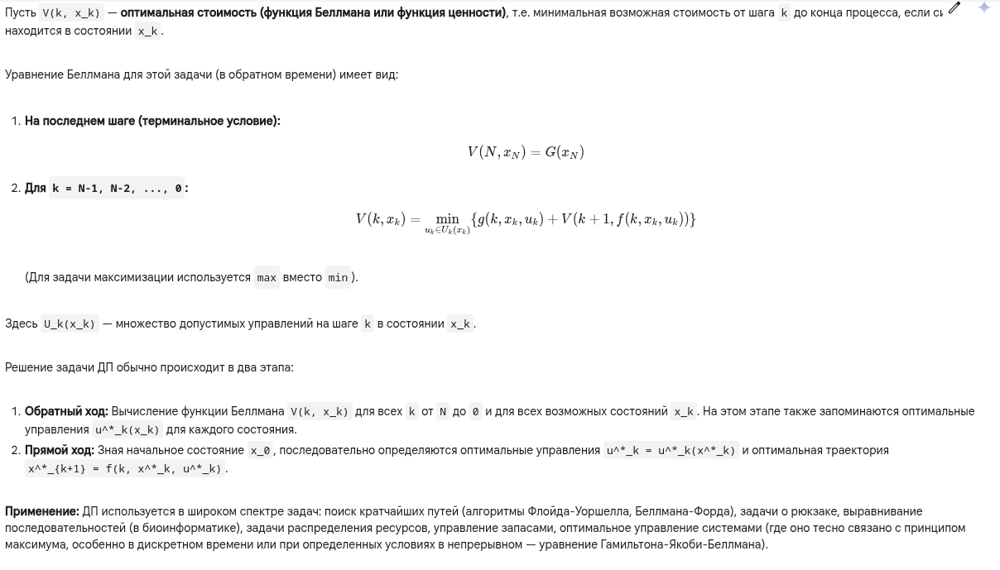

# Принцип динамического программирования

## 1. Краткий ответ

**Принцип динамического программирования (ДП)** — это метод решения сложных задач путем их разбиения на более простые, перекрывающиеся подзадачи. Он основан на **принципе оптимальности Беллмана**: оптимальная стратегия для всей задачи включает в себя оптимальные стратегии для всех ее подзадач, возникающих после первого шага. Решения подзадач запоминаются (мемоизация или табуляция), чтобы избежать повторных вычислений.

## 2. Развернутый ответ (академический)

**Ограничения**: Основным недостатком ДП является "проклятие размерности": вычислительная сложность и требования к памяти растут экспоненциально с увеличением размерности пространства состояний x_k.

## 3. Развернутый ответ (простыми словами)

Представьте, что вам нужно найти самый дешевый (или самый быстрый) путь из города А в город Я, проезжая через несколько других городов.

**Принцип динамического программирования** говорит: если вы нашли самый лучший путь из А в Я, и этот путь проходит через промежуточный город П, то та часть пути, которая идет от П до Я, *обязательно* должна быть самым лучшим путем из П в Я. Не может быть так, что вы доехали из А в П оптимально, а потом из П в Я поехали как-то неоптимально, но весь путь от А до Я вдруг оказался самым лучшим. Это и есть **принцип оптимальности Беллмана**.

Как это использовать для решения задачи? Вместо того чтобы перебирать *все* возможные пути от А до Я (что может быть очень долго), мы делаем так:

1.  **Разбиваем на этапы:** Думаем о задаче "задом наперед". Сначала находим лучшие пути до Я из *ближайших* к нему городов.
2.  **Находим лучшие пути из предпоследних городов:** Для каждого города, из которого можно напрямую доехать в Я, мы уже знаем стоимость этого последнего шага.
3.  **Находим лучшие пути из пред-предпоследних городов:** Для каждого такого города П_пред_пред смотрим все города П_пред, куда из него можно доехать. Мы уже знаем лучший путь от каждого П_пред до Я. Значит, чтобы найти лучший путь из П_пред_пред до Я через конкретный П_пред, нужно сложить стоимость пути от П_пред_пред до П_пред и уже известную стоимость лучшего пути от П_пред до Я. Мы выбираем тот П_пред, который дает минимальную суммарную стоимость. Это и будет лучший путь из П_пред_пред до Я.
4.  **Запоминаем результаты:** Самое главное — мы записываем (запоминаем) стоимость лучшего пути до Я из *каждого* промежуточного города, как только ее находим. Если нам снова понадобится эта информация для расчета пути из другого города, мы просто возьмем готовое значение, а не будем считать заново.
5.  **Повторяем, пока не дойдем до А:** Двигаясь так "с конца" к началу, мы в итоге найдем стоимость самого лучшего пути из А в Я.

**В чем суть:**

*   **Делим слона на части:** Большая задача делится на кучу маленьких, похожих друг на друга подзадач ("как лучше всего добраться до Я из города X?").
*   **Решаем подзадачи:** Находим оптимальные решения для этих маленьких подзадач.
*   **Используем принцип оптимальности:** Оптимальное решение большой задачи строится из оптимальных решений подзадач.
*   **Запоминаем и используем повторно:** Не решаем одну и ту же подзадачу дважды.

Этот подход очень эффективен для задач, где нужно принимать последовательность решений, и где результат каждого решения влияет на будущие возможности. Основная трудность – если "состояний" (в нашем примере – городов) становится очень много, то запоминать все решения для всех состояний может потребовать слишком много памяти.

---

Готов к следующей теме!