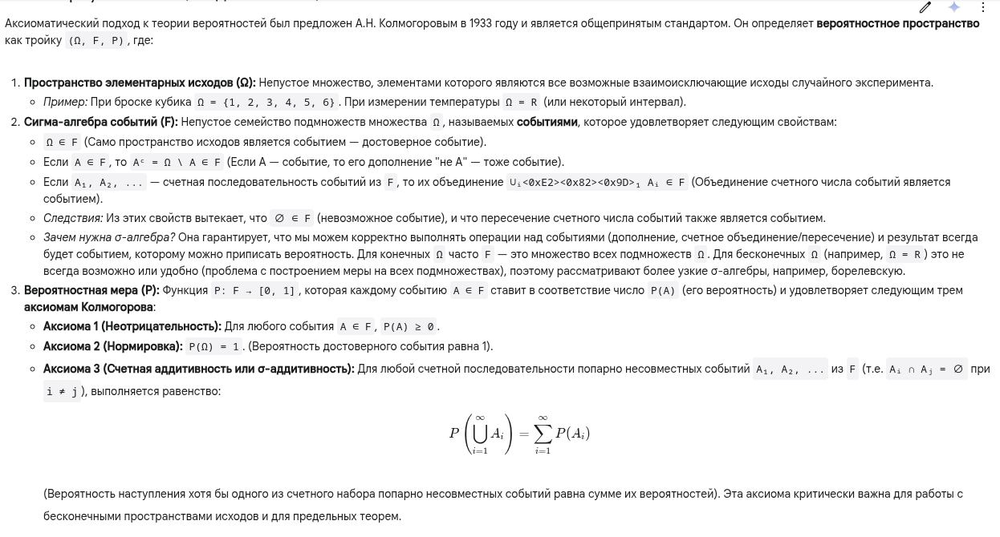
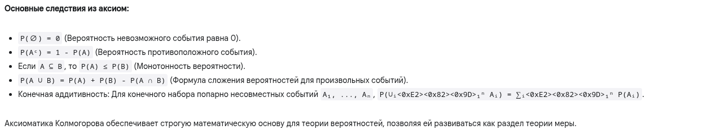
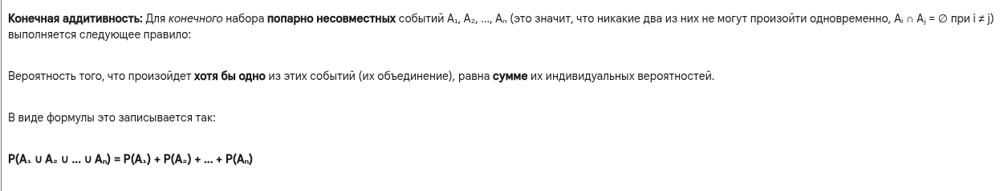
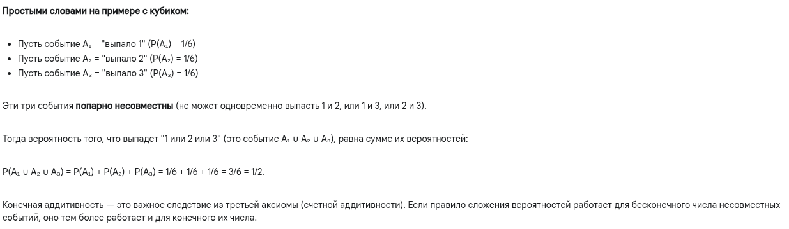

# Аксиоматика теории вероятностей

## Краткий ответ

Аксиоматика теории вероятностей (Колмогорова) — это формальный математический подход, определяющий вероятность как меру на множестве исходов. Он вводит тройку (Ω, F, P) — вероятностное пространство, где Ω — множество элементарных исходов, F — σ-алгебра событий (подмножеств Ω, которым можно приписать вероятность), а P — вероятностная мера (функция, ставящая в соответствие каждому событию число от 0 до 1), удовлетворяющая трем аксиомам: неотрицательности, нормировки и счетной аддитивности.

## Простыми словами

Представьте, что мы хотим строго описать случайные явления, например, подбрасывание монетки или игральную кость. Аксиоматика — это как фундамент и правила игры для вероятности.

1. Определяем все возможные исходы (Ω): Сначала мы должны четко перечислить всё, что в принципе может случиться в результате нашего "эксперимента". Каждый отдельный результат называется "элементарным исходом".

 - Монетка: Исходы = {Орел, Решка}.

- Кость: Исходы = {1, 2, 3, 4, 5, 6}.

- Этот полный список называется пространством элементарных исходов.

2. Определяем "события" (F): Событие — это то, о чем мы можем спросить "случилось или нет?" после эксперимента. Это может быть один исход ("выпал орел?") или набор исходов ("выпало четное число на кости?", т.е. {2, 4, 6}).

 - Мы должны договориться, какие именно наборы исходов мы будем считать "событиями". Этот набор правил называется сигма-алгеброй. Главное требование — если у нас есть событие A, то должно быть и событие "не A". Если есть события A и B, должно быть событие "A или B". Важно, что это работает и для бесконечного числа событий.

 - Проще говоря, мы определяем, на какие вопросы о результате эксперимента мы в принципе можем отвечать и вычислять их вероятность.

3. Вводим правила для вероятности (P) - Аксиомы: Вероятность — это число от 0 до 1, которое показывает, насколько вероятно событие. Чтобы все расчеты были логичными и непротиворечивыми, вероятность должна подчиняться трем главным правилам (аксиомам):

- Правило 1: Вероятность не бывает отрицательной. P(A) ≥ 0. Минимум 0 (невозможное событие), максимум 1 (достоверное событие).

- Правило 2: Вероятность того, что случится хоть что-то из нашего списка всех возможных исходов, равна 1. P(Ω) = 1. Когда мы бросаем кость, мы на 100% уверены, что выпадет какое-то число от 1 до 6.

- Правило 3: Если события не могут произойти одновременно (взаимоисключающие), то вероятность того, что произойдет или одно, или другое, равна сумме их вероятностей. P(A или B) = P(A) + P(B), если A и B несовместны. Например, вероятность выпадения "2" на кости равна 1/6, вероятность "4" — тоже 1/6. Они не могут выпасть вместе. Значит, вероятность выпадения "2 или 4" равна 1/6 + 1/6 = 2/6. Это правило работает и для бесконечного списка таких несовместных событий.

Зачем всё это? Эти три простых на вид правила (аксиомы) позволяют построить всю сложную математическую теорию вероятностей на строгом фундаменте. Они гарантируют, что мы можем логично и последовательно рассуждать о случайности, выводить формулы и доказывать теоремы, которые работают в самых разных ситуациях — от азартных игр до квантовой физики и финансового моделирования.

## Развернутый ответ

