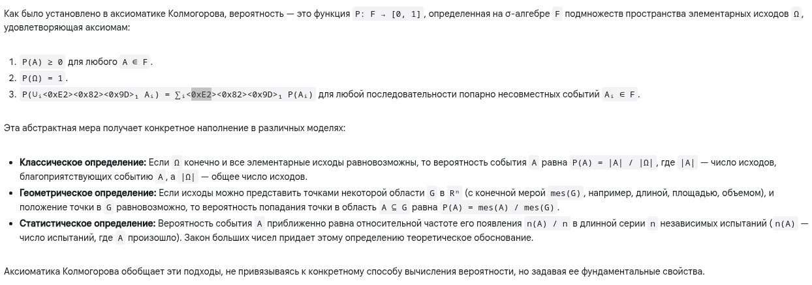
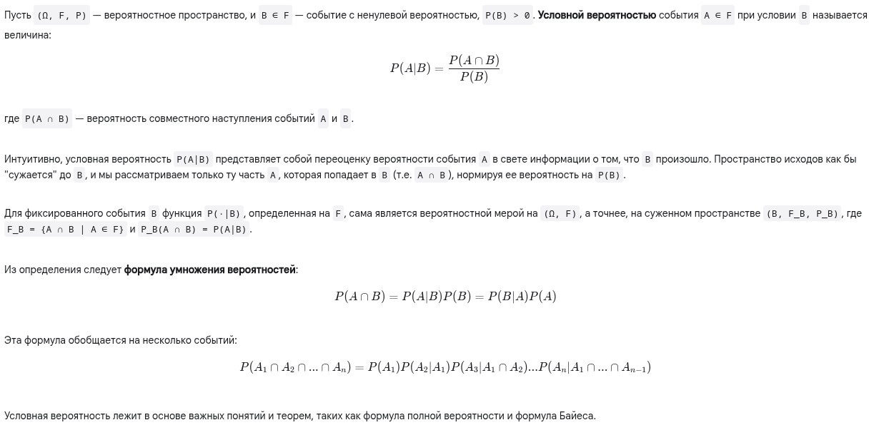
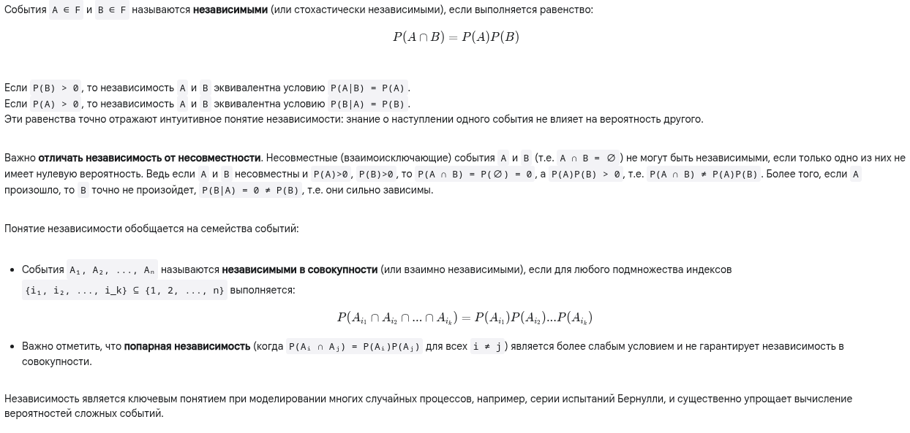

# Вероятность, условная вероятность. Независимость

## Краткий ответ

**Вероятность** — это числовая мера от 0 до 1, присваиваемая событиям (исходам случайного эксперимента), которая количественно характеризует степень возможности их наступления. Она определяется как функция P на σ-алгебре событий F, удовлетворяющая аксиомам Колмогорова.

**Условная вероятность P(A|B)** — это вероятность наступления события A при условии (при известности), что событие B уже произошло. Она вычисляется как P(A|B) = P(A ∩ B) / P(B), где P(B) > 0.

**Независимость**. Два события A и B называются независимыми, если наступление одного из них не изменяет вероятность наступления другого. Математически это означает, что P(A ∩ B) = P(A) P(B).

## Простыми словами

**Вероятность** — это просто число, которое показывает, насколько вероятно, что что-то произойдет. Это число всегда от 0 до 1 (или от 0% до 100%).

- Если вероятность равна 0, это значит, что событие точно не произойдет (невозможное событие).

- Если вероятность равна 1, это значит, что событие точно произойдет (достоверное событие).

- Если вероятность равна 0.5 (или 50%), это значит, что событие имеет равные шансы произойти или не произойти (как орел при подбрасывании монетки).

---

**Условная вероятность** — это вероятность события, но вычисленная с учетом какой-то новой информации. Это ответ на вопрос: "Какова вероятность, что произойдет А, если мы уже знаем, что произошло Б?".

Пример: Представьте колоду из 52 карт.

- Вероятность вытащить Короля (событие А) равна 4/52 = 1/13.

- Теперь предположим, вы вытащили карту, и кто-то, не говоря вам масть или достоинство, сказал, что это "картинка" (Валет, Дама или Король) (событие Б). Всего "картинок" 12.

- Какова теперь вероятность, что ваша карта — Король (событие А), при условии, что это "картинка" (событие Б)?

Мы знаем, что карта точно одна из 12 "картинок". Среди этих 12 картинок ровно 4 Короля. Значит, условная вероятность вытащить Короля при условии, что это картинка, равна 4/12 = 1/3.

Заметьте, 1/3 (условная вероятность) больше, чем 1/13 (изначальная вероятность). Новая информация ("это картинка") изменила наши шансы.

Формула P(A|B) = P(A и B) / P(B) как раз это и считает:

- P(A и B) - Вероятность вытащить карту, которая одновременно и Король, и "картинка" (это просто Король) = 4/52.

- P(B) - Вероятность вытащить "картинку" = 12/52.

- P(A|B) = (4/52) / (12/52) = 4/12 = 1/3.

---

**Независимость** — это когда два (или больше) события никак не влияют друг на друга. Произошло одно или нет — это никак не меняет шансы для другого.

Пример 1 (независимые события): Вы бросаете монетку два раза.

Событие A: Первый раз выпал орел. P(A) = 1/2.

Событие B: Второй раз выпал орел. P(B) = 1/2.
Результат первого броска никак не влияет на результат второго. Монетка не "помнит", что выпало раньше. Поэтому события A и B независимы. Вероятность, что оба раза выпадет орел (A и B), равна произведению их вероятностей: P(A и B) = P(A) * P(B) = 1/2 * 1/2 = 1/4.

Пример 2 (зависимые события): Вы тащите две карты из колоды без возвращения.

Событие A: Первая карта — Туз. P(A) = 4/52.

Событие B: Вторая карта — Туз.
Являются ли A и B независимыми? Нет. Если первая карта была Тузом (событие А произошло), то в колоде осталось 51 карта и только 3 Туза. Вероятность вытащить Туз второй картой при условии, что первая была Тузом, равна P(B|A) = 3/51. Это не равно изначальной вероятности вытащить Туз (4/52). Значит, события зависимы. Знание о первой карте меняет шансы для второй.

Главная идея независимости: Если события A и B независимы, то знать, что произошло B, абсолютно бесполезно для предсказания A (и наоборот). Их вероятности остаются такими же.

## Развернуый ответ

