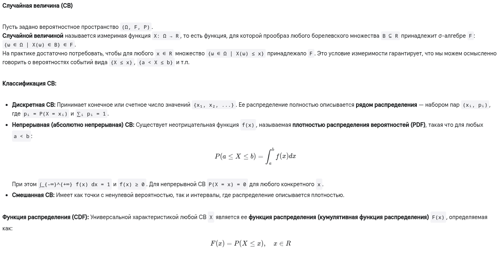
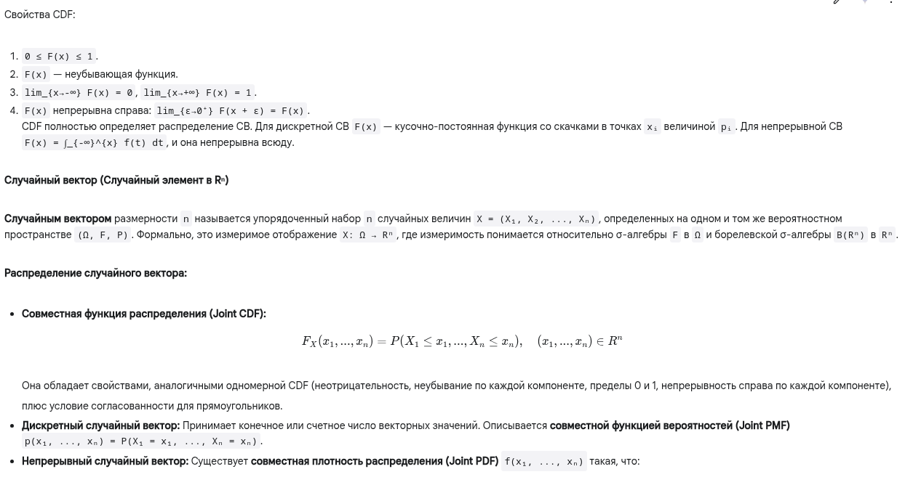
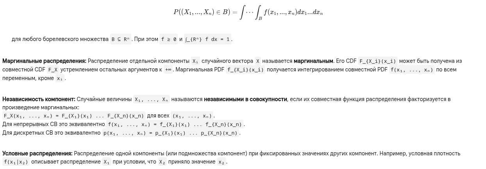

# Случайные величины и векторы

## Краткий ответ

Случайная величина (СВ) — это числовая функция, которая ставит в соответствие каждому элементарному исходу случайного эксперимента (из пространства Ω) некоторое действительное число. Случайный вектор — это вектор, компонентами которого являются случайные величины, определённые на одном и том же вероятностном пространстве; он ставит в соответствие каждому исходу эксперимента упорядоченный набор чисел (вектор). Они позволяют перевести результаты случайных явлений на язык чисел и векторов для математического анализа их вероятностных свойств (распределений).

## Простыми словами

**Случайная величина (СВ):**

Представьте, что вы проводите какой-то случайный эксперимент (бросаете кость, измеряете температуру, ждете автобус). Результат может быть разным. Случайная величина — это просто способ присвоить число каждому возможному результату.

- Бросок кости: Исходы {1, 2, 3, 4, 5, 6}. СВ X может быть просто числом, которое выпало. X=1, X=2, ..., X=6.

- Подбрасывание монетки: Исходы {Орел, Решка}. Можно определить СВ Y: Y=1, если Орел, Y=0, если Решка.

- Измерение роста человека: Исход — конкретный человек. СВ H — его рост в сантиметрах (например, H=175.3).

Зачем это нужно? Чтобы можно было использовать математику! Вместо описательных результатов ("орел", "решка") мы получаем числа, с которыми можно работать: считать среднее значение, разброс, вероятности попадания в интервал и т.д.

Случайные величины бывают:

- Дискретные: Принимают отдельные, изолированные значения (как число на кости или 0/1 для монетки). Их можно пересчитать.

- Непрерывные: Могут принимать любое значение из некоторого интервала (как рост человека или температура). Между любыми двумя возможными значениями всегда есть другое возможное значение.

Главное, что описывает случайную величину, — это ее распределение. Распределение говорит нам, какие значения СВ может принимать и с какими вероятностями.

- Для дискретных — это список значений и их вероятностей (например, для кости: 1 с вер. 1/6, 2 с вер. 1/6, ...).

- Для непрерывных — это плотность вероятности. Она показывает, где значения "гуще", а где "реже". Вероятность попасть в интервал — это площадь под графиком плотности над этим интервалом.

- Функция распределения (CDF) — универсальный способ описать распределение. Она отвечает на вопрос: "Какова вероятность, что случайная величина примет значение не больше, чем x?".

**Случайный вектор:**

Это когда мы в результате одного эксперимента измеряем сразу несколько числовых характеристик. Случайный вектор — это набор (кортеж) из нескольких случайных величин.

- Эксперимент: выбираем случайного человека. Случайный вектор Z = (H, W), где H — рост, W — вес. Для конкретного человека исходом будет пара чисел, например (180 см, 75 кг).

- Эксперимент: мониторим погоду в данный момент. Случайный вектор P = (T, H, Pr), где T — температура, H — влажность, Pr — давление.

Как и для одной СВ, случайный вектор описывается своим совместным распределением. Оно говорит, каковы вероятности различных комбинаций значений его компонент.

- Например, какова вероятность, что у случайно выбранного человека рост будет меньше 170 см И вес меньше 60 кг?

Важный аспект случайных векторов — зависимость между компонентами. Рост и вес человека обычно связаны (высокие люди, как правило, весят больше). Температура и влажность тоже могут быть связаны. Совместное распределение как раз и описывает эту связь.

- Если компоненты независимы (как результат первого и второго броска монетки), то знание значения одной компоненты ничего не говорит о значении другой. В этом случае совместное распределение просто равно произведению распределений отдельных компонент.

- Если компоненты зависимы, то их значения влияют друг на друга.

Мы также можем посмотреть на распределение только одной компоненты вектора, "забыв" про остальные. Это называется маргинальным распределением. Например, из вектора (Рост, Вес) мы можем извлечь просто распределение Роста само по себе.

## Развернутый ответ

