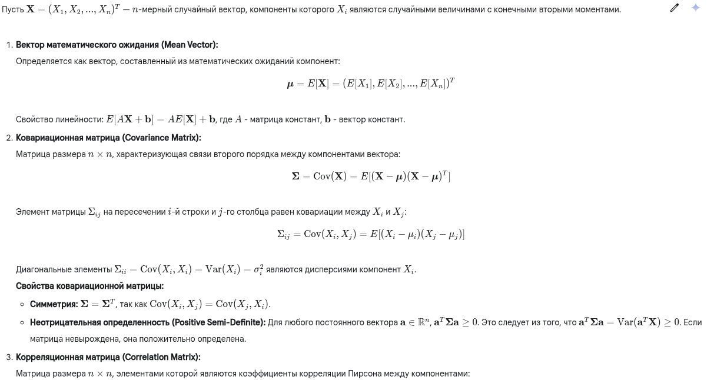
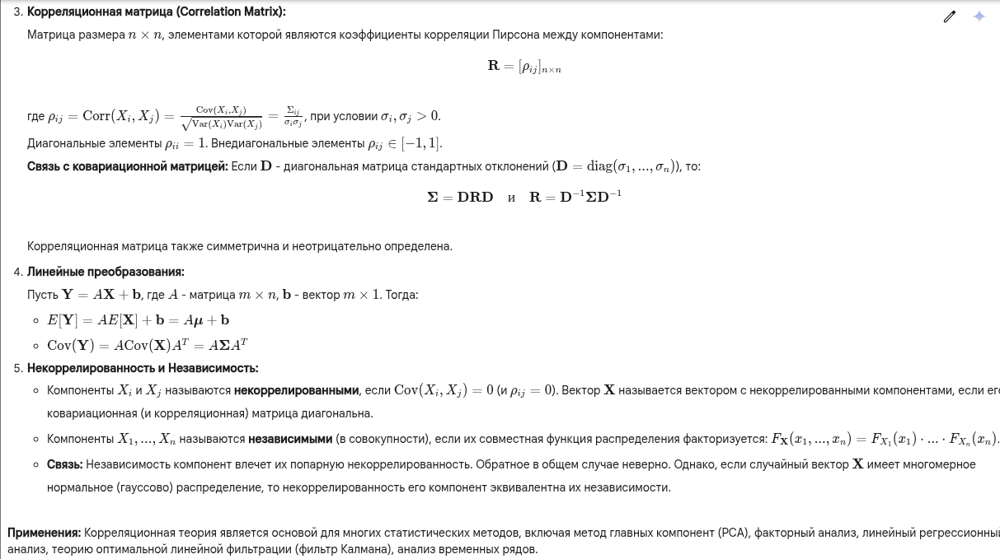

Окей, корреляционная теория случайных векторов — важный раздел теории вероятностей и математической статистики.

---

**1. Краткий ответ:**

Корреляционная теория случайных векторов изучает взаимосвязи между компонентами многомерного случайного вектора $\mathbf{X} = (X_1, ..., X_n)^T$, ограничиваясь характеристиками первых двух порядков: математическими ожиданиями и моментами второго порядка (дисперсиями и ковариациями). Основные инструменты — **вектор математического ожидания** $\boldsymbol{\mu}$, который показывает "центр" распределения, и **ковариационная матрица** $\mathbf{\Sigma}$, описывающая разброс каждой компоненты (дисперсии на диагонали) и линейную зависимость между парами компонент (ковариации вне диагонали). Нормализованная версия ковариационной матрицы — **корреляционная матрица** $\mathbf{R}$ — показывает силу и направление линейной связи (от -1 до 1). Теория также описывает, как эти характеристики преобразуются при линейных операциях над векторами, и лежит в основе многих методов анализа данных (например, метод главных компонент).

---

**2. Развернутый (академический) ответ:**

**3. Развернутый ответ простыми словами:**

Представь, что ты измеряешь сразу несколько характеристик у группы людей, например, их **рост**, **вес** и **возраст**. Это твой "случайный вектор" - набор случайных величин. Корреляционная теория помогает разобраться, как эти характеристики связаны между собой, но смотрит в основном на самые простые, *линейные* связи.

1.  **Среднее (Вектор математического ожидания):** Это просто средний рост, средний вес и средний возраст по всей группе. Он показывает "типичного" представителя, центр облака данных.

2.  **Разброс и Связи (Ковариационная матрица):** Эта матрица — как карта связей и разброса.
    *   **На диагонали** стоят *дисперсии*: насколько сильно разбросан рост сам по себе, насколько сильно разбросан вес, насколько сильно разбросан возраст. Большое значение — большой разброс.
    *   **Вне диагонали** стоят *ковариации*: они показывают, как две характеристики меняются *вместе*.
        *   *Положительная ковариация* (например, между ростом и весом): люди повыше обычно и весят больше. Величины "идут" в одну сторону.
        *   *Отрицательная ковариация* (например, между возрастом и скоростью бега, у взрослых): с возрастом скорость обычно падает. Величины "идут" в разные стороны.
        *   *Нулевая ковариация* (например, между ростом и IQ, скорее всего): знание роста не помогает предсказать IQ (линейно). Нет явной линейной связи.

3.  **Сила связи (Корреляционная матрица):** Ковариация зависит от единиц измерения (килограммы или граммы сильно изменят число). Чтобы избавиться от этого, используют *корреляцию*. Она всегда от -1 до +1.
    *   +1: Идеальная прямая связь "вверх" (чем больше одно, тем больше другое, строго по линии).
    *   -1: Идеальная прямая связь "вниз" (чем больше одно, тем меньше другое, строго по линии).
    *   0: Нет *линейной* связи. Важно: это не значит, что связи нет вообще, она может быть сложной, нелинейной!
    *   Числа между 0 и 1 (или 0 и -1) показывают *силу* этой линейной тенденции. 0.8 — сильная связь, 0.2 — слабая.
    На диагонали корреляционной матрицы всегда стоят единицы (рост идеально коррелирует сам с собой).

**Зачем это нужно?** Понимая эти связи, мы можем:
*   Предсказывать одну величину по другой (если рост и вес связаны, можно примерно оценить вес по росту).
*   Упрощать данные: если рост и размах рук очень сильно коррелируют (почти одно и то же), может, для анализа достаточно оставить только одну из этих характеристик? (Идея метода главных компонент).
*   Понимать структуру сложных систем в экономике, биологии, технике.

**Важно помнить:** Корреляционная теория хорошо ловит только *линейные* зависимости. Если связь сложная (например, U-образная), ковариация и корреляция могут быть близки к нулю, хотя величины явно зависят друг от друга.