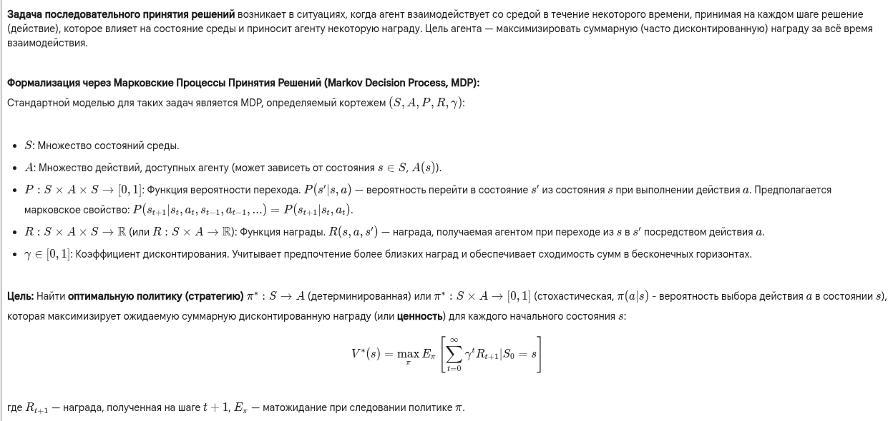
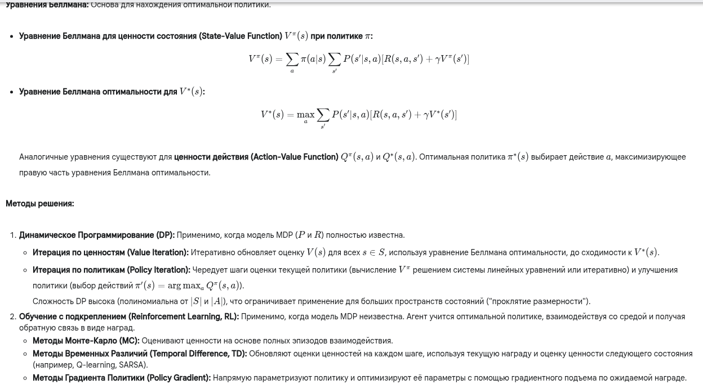

Окей, "Метод последовательного принятия решения" - это ключевое понятие, особенно в динамических системах, теории управления и искусственном интеллекте (в частности, в обучении с подкреплением).

---

**1. Краткий ответ:**

Метод последовательного принятия решения относится к задачам, где решения принимаются не однократно, а в виде **последовательности** во времени. Каждое принятое решение влияет на **состояние** системы и, следовательно, на будущие возможные решения и их исходы. Цель — найти оптимальную **стратегию** (или политику), то есть правило выбора действий в каждом состоянии, которая максимизирует некоторую суммарную выгоду (награду, полезность) за весь период времени. Классическим математическим аппаратом для таких задач являются **Марковские процессы принятия решений (MDP)**. Основная сложность — учесть долгосрочные последствия текущих действий. Методы решения включают динамическое программирование (если модель системы известна) и обучение с подкреплением (если модель неизвестна).

---

**2. Развернутый (академический) ответ:**

**3. Развернутый ответ простыми словами:**

Представь, что ты играешь в сложную компьютерную игру (например, шахматы или стратегию) или просто пытаешься добраться из точки А в точку Б в незнакомом городе. Ты не можешь принять все решения сразу, ты действуешь шаг за шагом.

**Последовательное принятие решений** – это как раз про такие ситуации:
1.  Ты находишься в каком-то **состоянии** (позиция на доске, твое текущее местоположение).
2.  У тебя есть несколько **действий** на выбор (сделать ход, пойти налево/направо).
3.  Каждое действие приводит тебя в **новое состояние** (новая позиция, новое место). Возможно, не всегда предсказуемо (противник может ответить по-разному, навигатор может ошибиться).
4.  За каждое действие или достигнутое состояние ты можешь получить "очки" или "штраф" (**награду**). Например, съел фигуру - плюс, попал в пробку - минус.
5.  Твоя **цель** – не просто получить максимум очков на следующем шаге, а выиграть всю партию или добраться до цели как можно быстрее/лучше, то есть набрать максимум очков *в долгосрочной перспективе*.

**В чем главная сложность?** Иногда нужно сделать ход, который кажется плохим сейчас (например, пожертвовать пешку), чтобы получить большое преимущество потом. Или нужно выбрать чуть более длинный путь сейчас, чтобы не попасть в большую пробку позже. Нужно думать наперед!

**Как найти лучшую стратегию?**
*   **Если ты знаешь все правила идеально** (как ходят фигуры в шахматах, как устроен город и где бывают пробки) – ты можешь рассчитать наилучший план действий заранее. Это похоже на **динамическое программирование**. Но это бывает очень сложно, если вариантов очень много.
*   **Если ты не знаешь всех правил или как поведет себя мир** – ты можешь учиться на ходу, методом проб и ошибок. Ты пробуешь разные действия, смотришь, что получается (какие "очки" приходят), и постепенно вырабатываешь стратегию, которая чаще приводит к успеху. Это похоже на **обучение с подкреплением**. Именно так часто обучают роботов или игровые ИИ.

В общем, метод последовательного принятия решений – это про то, как действовать умно в ситуациях, которые развиваются во времени, учитывая, что твои сегодняшние действия влияют на твое завтра.