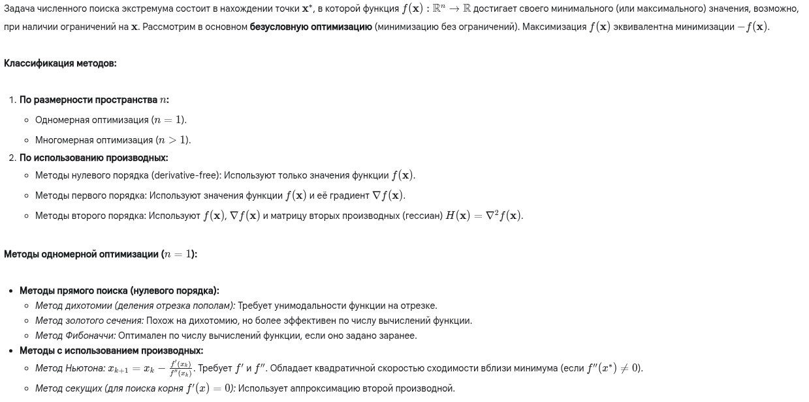
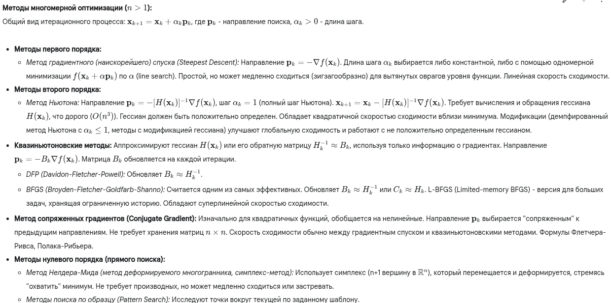
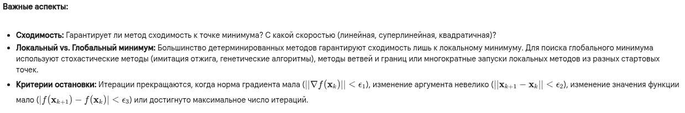

Окей, численные методы поиска экстремума — это фундаментальная часть вычислительной математики и оптимизации.

---

**1. Краткий ответ:**

Численные методы поиска экстремума — это алгоритмы для нахождения минимумов или максимумов функции (часто называемых **оптимумами**), когда аналитическое решение (через производные) невозможно или слишком сложно. Методы обычно **итерационные**: начиная с некоторой точки, они генерируют последовательность точек, сходящуюся к точке экстремума. Для функций **одной переменной** используют методы вроде золотого сечения (без производных) или Ньютона (с производными). Для функций **многих переменных** основные подходы включают: **градиентные методы** (например, метод наискорейшего спуска, использующий градиент $\nabla f$), методы второго порядка (метод Ньютона, использующий гессиан $H(f)$), и **методы без производных** (например, Нелдера-Мида). Большинство методов находят **локальные** экстремумы; поиск глобального экстремума — значительно более сложная задача.

---

**2. Развернутый (академический) ответ:**

---

**3. Развернутый ответ простыми словами:**

Представь, что ты стоишь на холмистой местности в густом тумане и хочешь найти самую низкую точку (долину) поблизости. Ты не видишь всей карты, только то, что у тебя под ногами. Численные методы — это разные стратегии, как добраться до низины.

*   **Стратегия 1: Иди туда, где круче всего вниз (Градиентный спуск)**
    Ты ощупываешь землю вокруг себя, находишь направление самого крутого спуска и делаешь шаг в этом направлении. Потом повторяешь: снова ищешь самый крутой спуск и делаешь шаг.
    *   *Плюс:* Просто и понятно.
    *   *Минус:* Если долина длинная и узкая ("овраг"), ты будешь долго скакать с одного склона на другой, медленно продвигаясь вдоль дна. Важно выбрать правильную длину шага: слишком маленький – будешь идти вечно, слишком большой – можешь перепрыгнуть долину.

*   **Стратегия 2: Учитывай не только уклон, но и кривизну (Метод Ньютона)**
    Ты не только смотришь, куда идет уклон, но и пытаешься понять, насколько быстро он меняется (кривизна поверхности). Если склон становится всё круче – долина далеко, если выполаживается – близко. Используя эту информацию, ты можешь сделать более точный "прыжок" сразу к предполагаемому дну долины.
    *   *Плюс:* Очень быстро сходится, если ты уже недалеко от дна.
    *   *Минус:* Сложно оценить кривизну (нужно считать "вторые производные"). Можно легко промахнуться, если ты далеко от цели или местность сложная (седловина).

*   **Стратегия 3: Умный градиентный спуск (Квазиньютоновские методы, Сопряженные градиенты)**
    Это как градиентный спуск, но с "памятью". Ты не просто идешь вниз, а учитываешь, откуда пришел, и стараешься не повторять шаги, которые ведут тебя поперек "оврага". Ты корректируешь направление, чтобы эффективнее двигаться вдоль дна долины. Это хороший компромисс между скоростью и сложностью вычислений.

*   **Стратегия 4: Совсем без уклона (Методы без производных, например, Нелдера-Мида)**
    Представь, что ты и еще двое друзей (втроем образуете треугольник - "симплекс") стоите на склоне. Вы сравниваете, кто стоит выше всех. Тот, кто выше, перешагивает через линию, соединяющую двух других, стараясь попасть ниже. Так ваш треугольник ползет вниз по склону, переворачиваясь и сжимаясь к самой низкой точке.
    *   *Плюс:* Работает, даже если ты не можешь определить уклон (например, функция "шумная").
    *   *Минус:* Часто медленнее, чем методы с уклоном, может застрять.

**Общая проблема:** Почти все эти методы приведут тебя в *ближайшую* низину (локальный минимум). Но она может быть не самой глубокой на всей карте (глобальный минимум). Найти самую-самую низкую точку – гораздо сложнее!