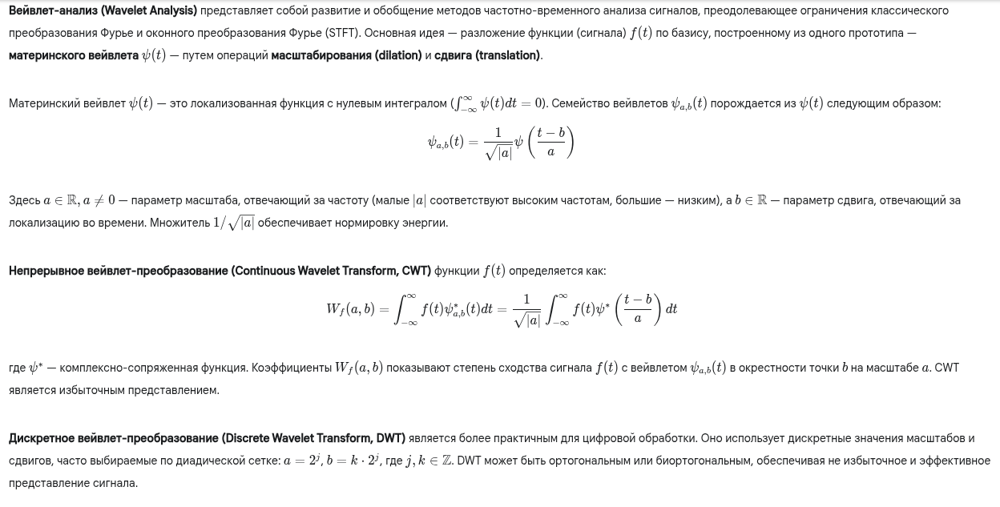
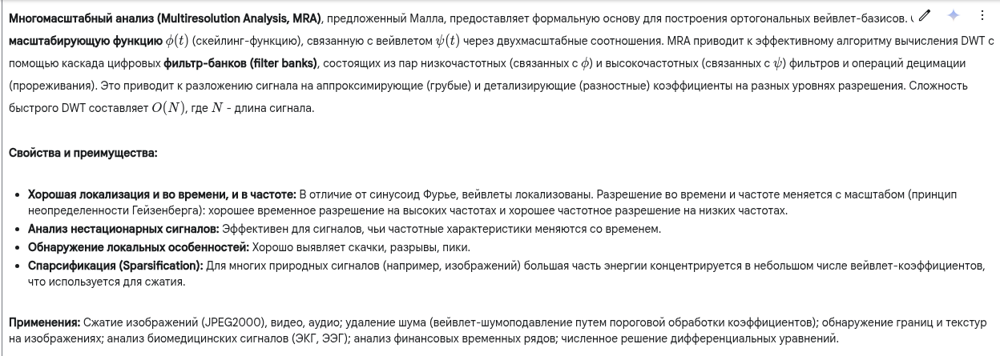

Отличный выбор! Вейвлет-анализ - мощный инструмент с широким применением.

---

**1. Краткий ответ:**

Вейвлет-анализ — это математический метод для анализа сигналов или функций, позволяющий изучить их частотные характеристики в зависимости от времени. В отличие от преобразования Фурье, которое даёт информацию о частотах во всём сигнале сразу (теряя временнУю локализацию), вейвлет-анализ использует специальные функции — **вейвлеты**. Это короткие, осциллирующие волновые пакеты, которые можно масштабировать (растягивать/сжимать для анализа разных частот) и сдвигать во времени. Анализ заключается в сравнении сигнала с этими масштабированными и сдвинутыми вейвлетами. Результат показывает, какие частоты (масштабы) присутствуют в сигнале и в какие моменты времени. Это особенно полезно для анализа нестационарных сигналов с локальными особенностями (скачками, пиками). Применяется в сжатии данных (JPEG2000), удалении шума, обработке изображений, анализе временных рядов.

---

**2. Развернутый (академический) ответ:**

---

**3. Развернутый ответ простыми словами:**

Представь, что ты анализируешь музыкальное произведение.
*   **Преобразование Фурье** похоже на то, как если бы ты просто перечислил все инструменты, которые играли в оркестре (скрипки, барабаны, флейты), и насколько громко каждый из них играл в среднем за всё произведение. Ты узнаешь *какие* частоты (ноты) были, но не узнаешь, *когда* именно играл барабан, а когда — флейта.
*   **Вейвлет-анализ** — это как получить **полную партитуру** музыки. Ты видишь не только, какие инструменты (частоты) играли, но и в какой *момент времени* каждый из них вступал и замолкал.

Как он это делает? Вместо бесконечных гладких волн (синусоид), как у Фурье, вейвлет-анализ использует специальные "короткие волны" — **вейвлеты**. Эти вейвлеты похожи на математические "лупы" или "пробники":
1.  Есть **разные размеры** "луп":
    *   Маленькие, "острые" вейвлеты (как лупа с большим увеличением) хорошо ловят быстрые, короткие события, мелкие детали, высокие частоты.
    *   Большие, "плавные" вейвлеты (как лупа с малым увеличением) хорошо видят медленные изменения, общую форму, низкие частоты.
2.  Эти "лупы" **двигаются** вдоль сигнала (музыки, картинки, графика цены акции).
3.  В каждый момент времени и для каждого размера "лупы" вейвлет-анализ смотрит, насколько сигнал *похож* на эту "лупу".

**Результат:** Карта сигнала, где по одной оси — время, а по другой — размер "лупы" (масштаб или частота). Яркие пятна на этой карте показывают: "Вот в этот момент времени была активна вот такая частота/деталь вот такого размера!".

**Зачем это круто?**
*   **Ловит внезапные события:** Если в музыке внезапно ударил барабан или на картинке есть резкая граница, вейвлет-анализ это точно покажет. Фурье с этим справляется плохо.
*   **Убирает шум:** Шум часто выглядит как много мелких, быстрых колебаний. Вейвлет-анализ находит соответствующие им "маленькие лупы" и может их приглушить, не затронув полезный сигнал.
*   **Сжимает данные:** В картинках, например, большие гладкие области хорошо описываются "большими лупами". Мелкие детали — "маленькими". Если деталей мало, можно выбросить информацию от большинства "маленьких луп", и картинка почти не изменится, но будет занимать гораздо меньше места (принцип сжатия JPEG2000).

В общем, вейвлет-анализ — это как микроскоп, который может менять увеличение и двигаться по образцу, чтобы рассмотреть все его детали в нужном масштабе и в нужном месте.