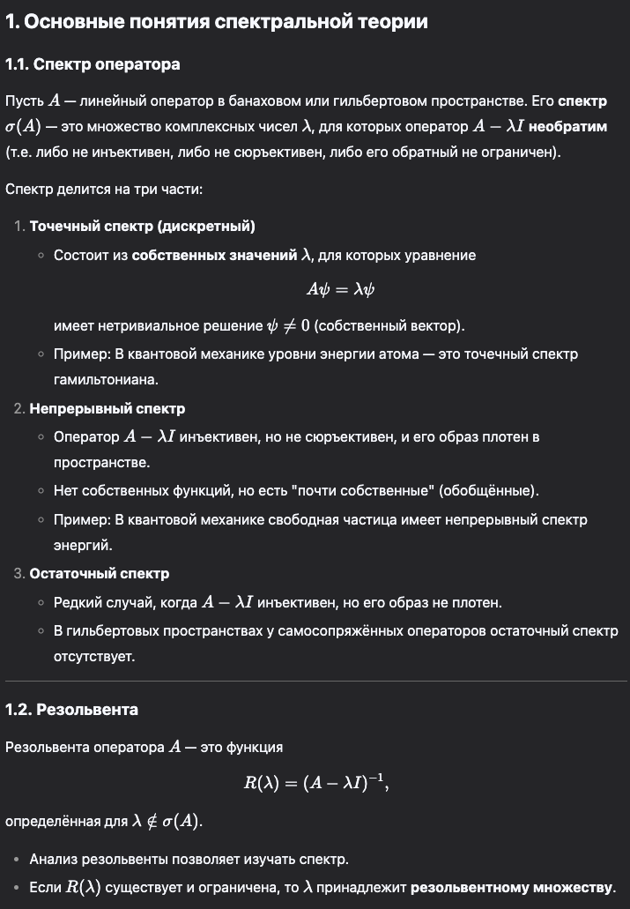
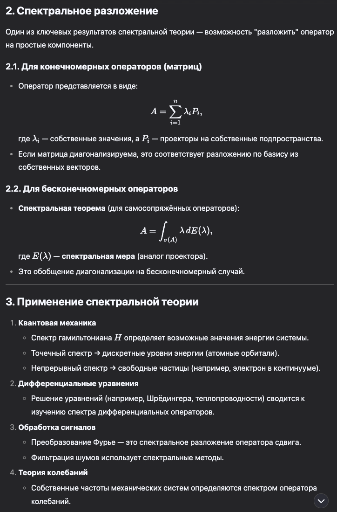
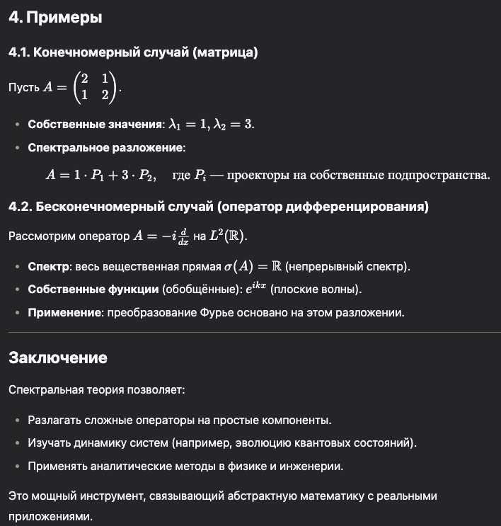

# Элементы спектральной теории

## Своими словами

**​Спектральная теория** — это раздел математики, который помогает понять, как сложные системы могут быть разобраны на более простые части с помощью анализа их внутренних характеристик.​

**Простое объяснение:**

Представьте музыкальный аккорд, состоящий из нескольких нот, звучащих одновременно. Спектральный анализ позволяет "разложить" этот аккорд на отдельные ноты, чтобы понять, какие именно звуки его составляют.​

В математике и физике спектральная теория выполняет похожую задачу: она изучает, как сложные математические объекты или операторы могут быть представлены через их основные составляющие, называемые собственными значениями и собственными векторами.​

**Применение:**

- Физика: В квантовой механике спектральная теория используется для определения возможных состояний и энергий частиц.​

- Инженерия: В обработке сигналов помогает анализировать частотный состав сигналов, что важно в коммуникациях и аудиотехнологиях.​

- Математика: Помогает решать дифференциальные уравнения и изучать свойства различных операторов.​

Понимание спектральной теории позволяет глубже анализировать и предсказывать поведение различных систем в науке и технике.

## Краткий ответ

Спектральная теория — это раздел математики, изучающий свойства линейных операторов через их спектры, то есть множества собственных значений. Она играет ключевую роль в функциональном анализе и имеет широкие приложения в математической физике и других областях.

Спектральная теория исследует линейные операторы, особенно их собственные значения и собственные векторы, чтобы понять и описать поведение сложных систем. Она обобщает понятия, связанные с диагонализацией матриц, на более общие случаи операторов в бесконечномерных пространствах.

## Развернутый ответ

Основные понятия:

- Линейный оператор: Функция, отображающая векторное пространство в себя, сохраняющая операции сложения и умножения на скаляр.​

- Собственное значение и собственный вектор: Для оператора 𝐴 вектор 𝑣 называется собственным вектором, если 𝐴𝑣 = 𝜆𝑣, где 𝜆 — скаляр, называемый собственным значением, соответствующим 𝑣.​

**Спектральная теорема:**

Спектральная теорема предоставляет условия, при которых оператор можно представить в диагональной форме, что упрощает его анализ. Для самосопряжённых операторов в гильбертовом пространстве теорема утверждает, что такой оператор можно представить в виде интеграла по его спектру с участием спектральной меры.​

**Спектральная мера:**

Это отображение, которое каждому измеримому множеству сопоставляет ортогональный проектор в гильбертовом пространстве. Спектральная мера позволяет представить оператор как интеграл по спектру, что является обобщением диагонализации для бесконечномерных пространств.​

**Приложения:**

Спектральная теория широко применяется в математической физике, особенно в квантовой механике, где наблюдаемые величины представляются самосопряжёнными операторами, а их спектры соответствуют возможным значениям измерений. Также она используется в решении дифференциальных уравнений и анализе динамических систем.​

Понимание спектральной теории позволяет глубже исследовать структуру операторов и функций, что имеет фундаментальное значение в различных разделах математики и её приложениях.

# Супер развернуто

