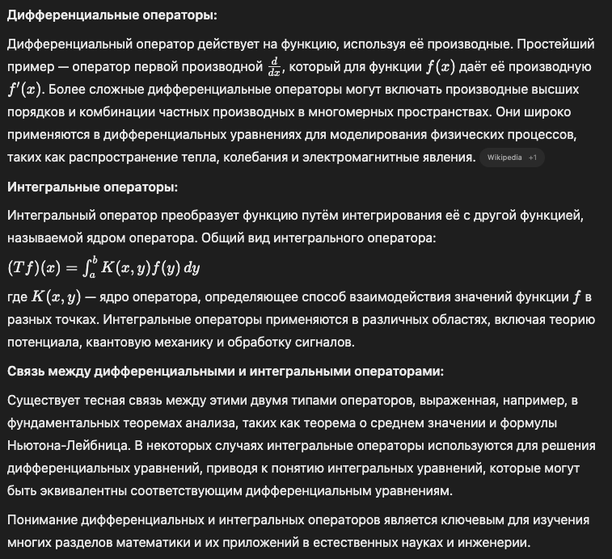

# Дифференциальные и интегральные операторы

## Простыми словами

​Дифференциальные и интегральные операторы — это инструменты в математике, которые помогают анализировать, как функции изменяются и накапливают значения. Давайте рассмотрим их на простых примерах.​

**Дифференциальные операторы:**

Представьте себе график, показывающий, как вы проехали на велосипеде: горизонтальная ось — это время, а вертикальная — расстояние. Если вы хотите узнать, с какой скоростью вы двигались в определенный момент, вам нужно посмотреть, как быстро менялось расстояние относительно времени.​

Дифференциальный оператор помогает определить эту скорость изменения. Он берет функцию (в нашем случае — пройденное расстояние) и вычисляет, как быстро она изменяется в каждый момент времени.​

**Интегральные операторы:**

Теперь представьте, что вы знаете, с какой скоростью вы ехали в каждый момент времени, и хотите узнать, какое общее расстояние вы преодолели за определенный период.​

Интегральный оператор позволяет вычислить общее накопленное значение функции за определенный интервал. В нашем примере он помогает определить общее расстояние, учитывая скорость в каждый момент времени.​

**Связь между ними:**

Дифференциальные и интегральные операторы связаны между собой. Если вы сначала вычислите производную функции (то есть скорость изменения), а затем проинтегрируете её, вы вернетесь к исходной функции (с точностью до постоянной). Это фундаментальная концепция в математике, известная как основной закон математического анализа.​

**Применение:**

- Эти операторы широко используются в различных областях:​

- Физика: Для описания движения объектов, распространения волн и других явлений.​

- Инженерия: В анализе сигналов, управлении системами и обработке изображений.​

- Экономика: Для моделирования изменений в экономических показателях и прогнозирования тенденций.​

Понимание дифференциальных и интегральных операторов помогает анализировать, как системы изменяются и накапливают эффекты со временем, что важно для решения многих практических задач.

## Краткий ответ

​Дифференциальные и интегральные операторы являются фундаментальными инструментами в математическом анализе, используемыми для исследования изменений функций и накопления их значений соответственно.​

- Дифференциальный оператор представляет собой математическое выражение, включающее производные функции, и применяется для анализа скорости изменения функции.​

- Интегральный оператор — это оператор, который преобразует функцию в новую функцию путём интегрирования, отражая накопленный эффект исходной функции.

## Развернутый ответ

