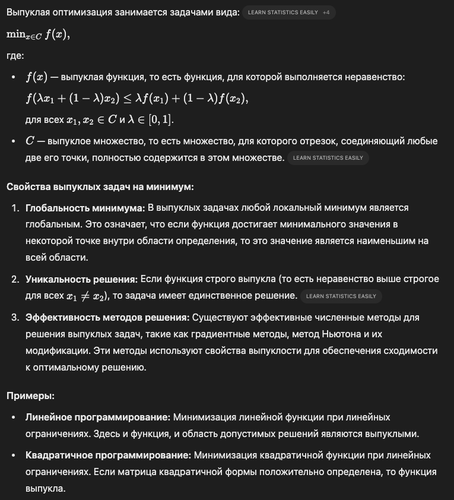

# Выпуклые задачи на минимум

## Краткий ответ

Выпуклые задачи на минимум относятся к области математической оптимизации, где цель состоит в нахождении минимального значения выпуклой функции на выпуклом множестве.​

Выпуклая задача на минимум — это задача оптимизации, в которой минимизируется выпуклая функция при условии, что область допустимых решений также является выпуклым множеством. Такие задачи обладают важным свойством: любой локальный минимум является также и глобальным минимумом, что упрощает их анализ и решение.​

## Простыми словами

Выпуклые задачи на минимум — это особый класс задач в математике, где цель состоит в нахождении наименьшего значения функции, обладающей определенными свойствами, на множестве, также обладающем особыми характеристиками. Давайте разберем это на простом примере.​

**Пример из жизни:**

Представьте, что вы гуляете по парку, и перед вами большая чаша, напоминающая форму параболы. Вы хотите найти самую низкую точку этой чаши — это и будет задачей нахождения минимума.

**Что такое выпуклая функция?**

В нашем примере форма чаши представляет собой график функции. Если мысленно соединить любую пару точек на краю чаши прямой линией, и эта линия всегда будет проходить выше поверхности чаши или касаться ее, то такую форму (и соответствующую функцию) называют выпуклой.​

**Что такое выпуклое множество?**

Представьте, что вы ограничили область поиска внутри чаши, например, выбрав круглый участок на ее дне. Если взять любые две точки внутри этого участка и соединить их прямой линией, и вся эта линия остается внутри выбранного участка, то такой участок называют выпуклым множеством.​

**Почему это важно?**

В задачах с выпуклой функцией и выпуклым множеством поиска есть важное свойство: если вы нашли точку, где функция принимает наименьшее значение (минимум), то это гарантированно самый низкий уровень во всей области. Иными словами, локальный минимум (точка, где значение функции меньше, чем у соседних точек) является также и глобальным минимумом (самым низким значением на всей области).​

**Применение:**

Такие задачи встречаются во многих сферах:​

- Финансы: Оптимальное распределение инвестиций для минимизации риска.​

- Инженерия: Проектирование конструкций с минимальным расходом материалов при сохранении прочности.​

- Машинное обучение: Настройка моделей для минимизации ошибки предсказаний.​

**Методы решения:**

Существует несколько подходов для нахождения минимума в выпуклых задачах:​

- Градиентный спуск: Представьте, что вы стоите на склоне горы и хотите спуститься в долину. Вы смотрите, в каком направлении склон наиболее крутой вниз, и делаете шаг в этом направлении. Повторяя этот процесс, вы постепенно спуститесь в самую низкую точку.​

- Метод внутренней точки: Вместо того чтобы двигаться по краю области поиска, вы начинаете внутри нее и постепенно продвигаетесь к минимуму, оставаясь внутри допустимой области.

## Развернутый ответ

