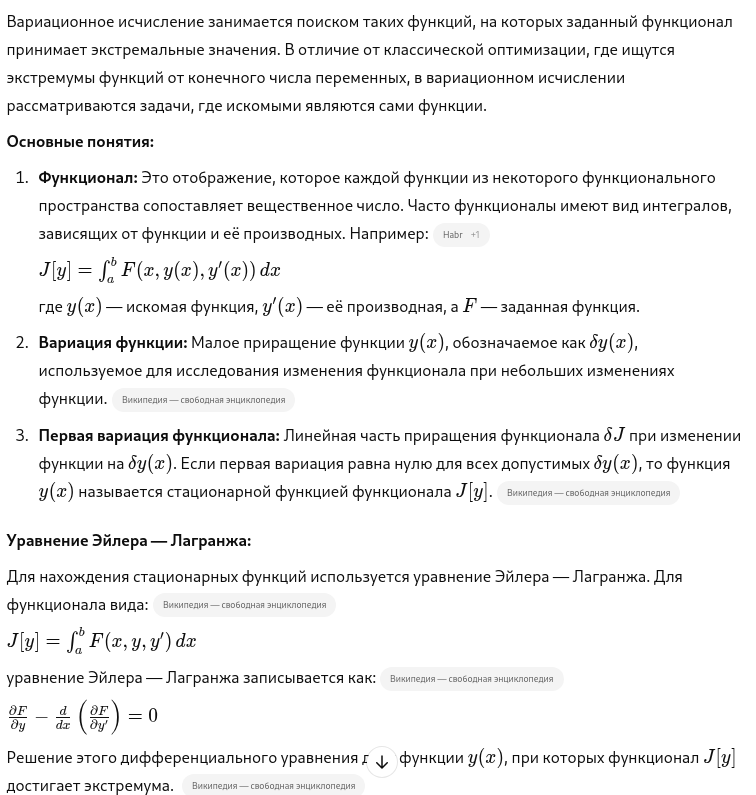
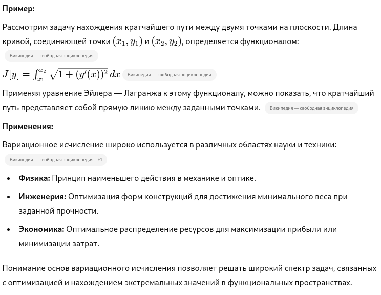

# Основы вариационного исчисления

## Краткий ответ

**Вариационное исчисление** — это раздел математического анализа, изучающий методы нахождения функций, при которых определённые функционалы достигают экстремальных значений (минимума или максимума). Функционал — это отображение, сопоставляющее функции вещественное число, часто выражаемое в виде интеграла, зависящего от функции и её производных. Ключевым инструментом вариационного исчисления является уравнение Эйлера — Лагранжа, необходимое для определения функций, экстремизирующих заданный функционал. 

## Простыми словами

​Вариационное исчисление — это раздел математики, который помогает находить такую функцию, при которой определённая величина (называемая функционалом) принимает наибольшее или наименьшее значение. Проще говоря, это метод поиска оптимального решения среди множества возможных вариантов, когда искомыми являются не просто числа, а целые функции.​

**Что такое функционал?**

Функционал — это правило, которое каждой функции сопоставляет одно число. Обычно функционалы выражаются через интегралы, зависящие от функции и её производных. Например, если вы хотите найти форму цепи, которая висит между двумя точками и имеет минимальную потенциальную энергию, то эта энергия будет функционалом, зависящим от формы (функции) цепи.​

**Как решаются задачи вариационного исчисления?**

Чтобы найти функцию, при которой функционал достигает экстремума (максимума или минимума), используется специальное уравнение — уравнение Эйлера — Лагранжа. Оно позволяет определить, как должна выглядеть функция, чтобы функционал был экстремальным. Решив это уравнение, можно найти оптимальную функцию для заданной задачи.​

**Пример из жизни:**

Представьте, что вы хотите проложить дорожку между двумя точками так, чтобы её длина была минимальной. Интуитивно понятно, что прямая линия — самый короткий путь. Вариационное исчисление формализует этот процесс: оно позволяет математически доказать, что прямая линия действительно является оптимальным решением, минимизирующим длину дорожки.​

**Где применяется вариационное исчисление?**

Этот метод широко используется в различных областях:​

- Физика: Для вывода уравнений движения частиц и определения траекторий, по которым движутся тела.​

- Инженерия: При проектировании конструкций с минимальным расходом материалов и максимальной прочностью.​

- Экономика: Для оптимизации распределения ресурсов и максимизации прибыли.​

Понимание основ вариационного исчисления позволяет решать задачи, где необходимо найти наилучший вариант среди множества возможных, особенно когда речь идёт о функциях, описывающих процессы или явления.

## Развернутый ответ

