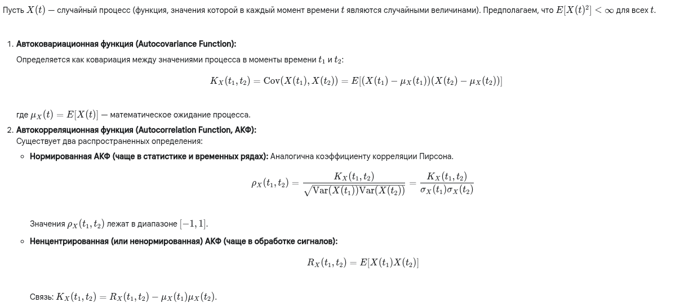
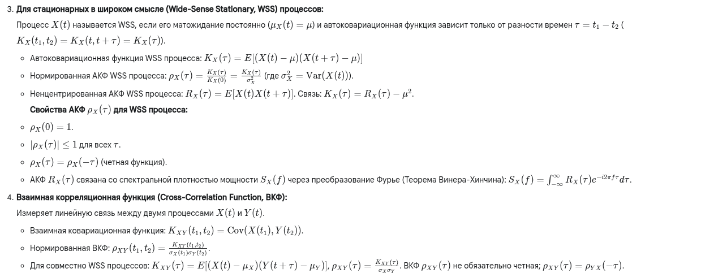
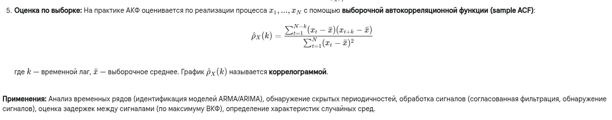

Хорошо, давайте разберем корреляционную функцию. Это понятие используется в основном при анализе случайных процессов (временных рядов).

---

**1. Краткий ответ:**

**Корреляционная функция** случайного процесса показывает степень **линейной взаимосвязи** между значениями этого процесса в **разные моменты времени**. Чаще всего рассматривают **автокорреляционную функцию (АКФ)**, которая измеряет связь процесса *с самим собой* в моменты времени $t_1$ и $t_2$. Если процесс стационарен, АКФ зависит только от разности времен $\tau = t_1 - t_2$ и показывает, как быстро процесс "забывает" свои предыдущие значения (обычно АКФ убывает с ростом $|\tau|$). Существует также **взаимная корреляционная функция (ВКФ)**, которая измеряет связь между двумя *разными* случайными процессами. Корреляционные функции являются ключевым инструментом для анализа структуры временных рядов, выявления периодичностей, построения моделей (например, ARMA) и в обработке сигналов (например, для обнаружения сигналов на фоне шума).

---

**2. Развернутый (академический) ответ:**

---

**3. Развернутый ответ простыми словами:**

Представь, что ты наблюдаешь за чем-то, что меняется со временем, например, за температурой воздуха каждый час или за ценой акции каждую минуту. Это "случайный процесс".

**Корреляционная функция** помогает ответить на вопрос: "Насколько сильно значение *сейчас* связано со значением *в прошлом* (или *в будущем*)?"

*   **Автокорреляционная функция (АКФ):** Сравнивает процесс сам с собой.
    *   Насколько сегодняшняя температура похожа на вчерашнюю (в то же время)? Скорее всего, сильно похожа (высокая корреляция при лаге 24 часа).
    *   Насколько сегодняшняя температура похожа на температуру час назад? Еще сильнее похожа (очень высокая корреляция при лаге 1 час).
    *   Насколько сегодняшняя температура похожа на температуру полгода назад? Скорее всего, совсем не похожа, может быть даже наоборот (отрицательная корреляция при лаге ~6 месяцев).
    *   Насколько сегодняшняя температура похожа на саму себя прямо сейчас (лаг 0)? Они идентичны (корреляция = 1).

    АКФ обычно строят как график: по горизонтали – временной сдвиг (лаг), по вертикали – значение корреляции (от -1 до 1). Этот график показывает "память" процесса:
    *   Если график быстро падает до нуля, значит, процесс быстро "забывает" свое прошлое.
    *   Если график медленно затухает, значит, процесс имеет "долгую память".
    *   Если график колеблется, это может указывать на периодические закономерности (например, суточные или годовые циклы).

*   **Взаимная корреляционная функция (ВКФ):** Сравнивает два *разных* процесса. Например, температуру и скорость ветра.
    *   Связаны ли они? Если да, то как?
    *   Есть ли задержка? Например, ветер усиливается, а температура падает *через час* после этого? ВКФ поможет это увидеть, показав пик корреляции не при нулевом лаге, а при лаге в 1 час.

**Зачем это нужно?** Анализируя корреляционные функции, можно:
*   Понять, есть ли в данных какие-то скрытые циклы или зависимости.
*   Построить модель для прогнозирования будущих значений (если есть сильная корреляция с прошлым).
*   Обнаружить слабый сигнал на фоне шума (если мы знаем форму сигнала, мы можем искать его с помощью корреляции).
*   Определить, насколько одна система влияет на другую и с какой задержкой.