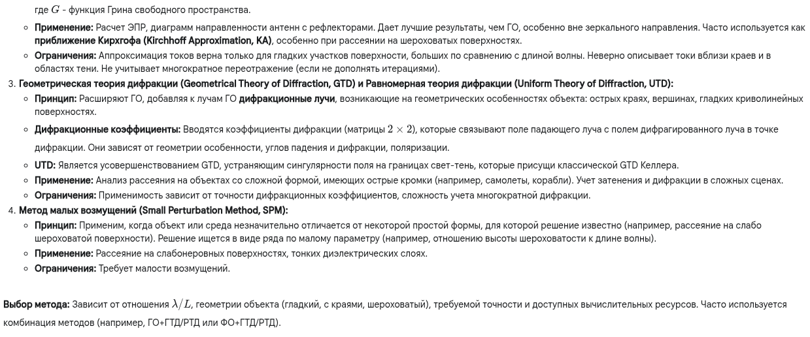

О, это интересная и важная тема в электродинамике и радиолокации. Точные расчеты часто очень сложны.

---

**1. Краткий ответ:**

Приближенные методы расчета отраженного электромагнитного поля используются, когда точное решение уравнений Максвелла для сложных объектов или сред затруднительно или нецелесообразно. Основные методы базируются на **высокочастотных приближениях** (когда длина волны $\lambda$ мала по сравнению с размерами объекта $L$).
*   **Геометрическая оптика (ГО):** Трассировка лучей, отражающихся и преломляющихся по законам Снеллиуса и Френеля. Игнорирует дифракцию.
*   **Физическая оптика (ФО):** Уточняет ГО, аппроксимируя поверхностные токи на освещенной части объекта ($\mathbf{J}_s \approx 2\hat{n} \times \mathbf{H}_{inc}$ для идеального проводника) и вычисляя поле через интеграл излучения этих токов. Лучше описывает рассеяние вне зеркального направления, но не учитывает краевые эффекты.
*   **Геометрическая теория дифракции (ГТД) / Равномерная теория дифракции (РТД):** Дополняют ГО лучами, дифрагированными на краях, углах и криволинейных поверхностях, вводя коэффициенты дифракции.
Эти методы позволяют оценить отраженное поле со скоростью, значительно превышающей строгие численные методы (ММИ, КЭМ, FDTD).

---

**2. Развернутый (академический) ответ:**

---

**3. Развернутый ответ простыми словами:**

Представь, что ты хочешь понять, как свет (или радиоволна) отражается от какого-то предмета, например, от машины или самолета. Точно рассчитать это по законам физики (уравнениям Максвелла) очень сложно, как решать суперсложную головоломку. Поэтому используют хитрости – приближенные методы. Они работают хорошо, если волна "короткая" по сравнению с размером предмета (как мелкая рябь на большом озере).

1.  **Геометрическая оптика (ГО):** Самый простой способ. Мы просто рисуем лучи света, которые летят прямо, ударяются о предмет и отражаются, как мячик от стенки (по закону "угол падения равен углу отражения").
    *   *Похоже на:* Рисование отражения в зеркале.
    *   *Минус:* Не учитывает, что свет немного "загибается" за углы (дифракция) и что тень не идеально резкая. Работает только для очень больших и гладких поверхностей.

2.  **Физическая оптика (ФО):** Чуть умнее. Мы говорим: там, куда свет падает на предмет, поверхность сама начинает светиться (излучать вторичные волны). Мы считаем, как она "светится" (какие токи там возникают), и потом суммируем излучение от всех освещенных кусочков поверхности.
    *   *Похоже на:* Представление, что освещенная часть машины сама становится источником света.
    *   *Плюс:* Лучше описывает, как свет рассеивается в разные стороны, а не только в зеркальном направлении.
    *   *Минус:* Всё ещё плохо работает у краев и углов, потому что там токи устроены сложнее.

3.  **Теории дифракции (ГТД/РТД):** Еще умнее. Они говорят: да, есть обычные отраженные лучи (как в ГО), но еще есть специальные лучи, которые рождаются на острых краях, углах и изгибах предмета. Эти лучи и объясняют, почему свет "затекает" в тень.
    *   *Похоже на:* Учет того, что острые края тоже "светятся" по-особому, когда на них падает свет.
    *   *Плюс:* Гораздо лучше описывает отражение от предметов сложной формы с углами и краями (как у самолета-невидимки).
    *   *Минус:* Сложные формулы для этих краевых лучей.

4.  **Метод малых возмущений (SPM):** Работает для немного "неровных" поверхностей. Если у тебя есть почти плоская, но чуть-чуть шероховатая поверхность, этот метод позволяет посчитать отражение, считая неровности маленькой помехой.
    *   *Похоже на:* Расчет отражения от почти гладкого озера с легкой рябью.
    *   *Минус:* Работает только для очень маленьких неровностей.

**Итог:** Инженеры выбирают метод в зависимости от задачи. Нужна быстрая оценка для большого гладкого объекта – берут ГО или ФО. Нужно точно посчитать отражение от самолета с острыми краями – используют ГТД/РТД. Эти методы намного быстрее, чем пытаться решить "головоломку" полностью на суперкомпьютере.