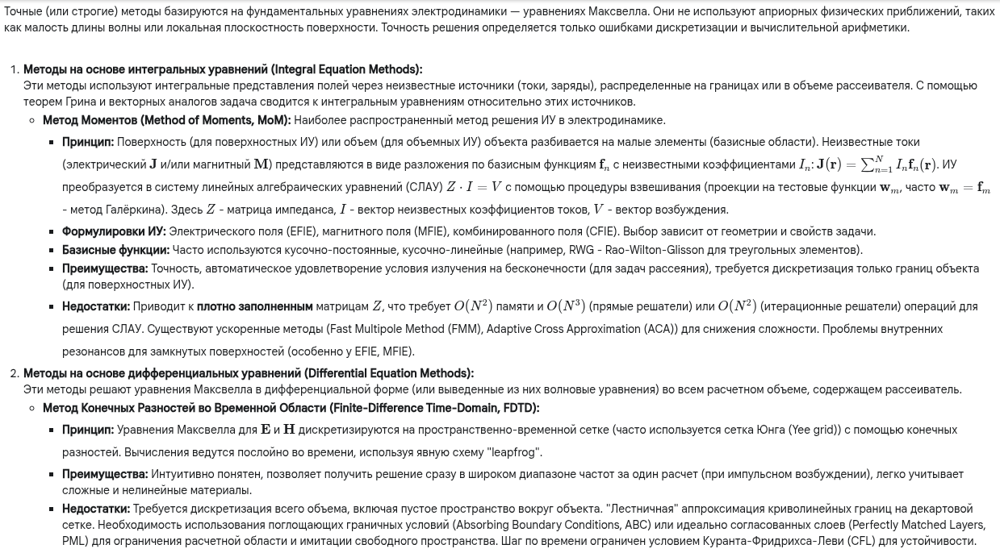
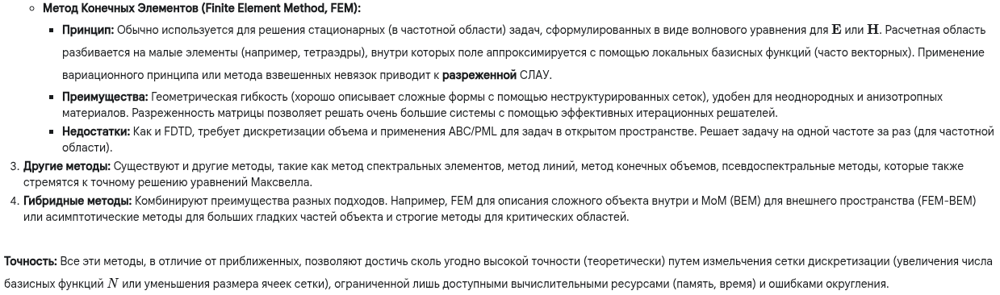

Отличный вопрос! Переходим от приближений к методам, которые стремятся решить задачу "в лоб", основываясь непосредственно на уравнениях Максвелла.

---

**1. Краткий ответ:**

Точные методы расчета отраженного электромагнитного поля напрямую решают **уравнения Максвелла** или эквивалентные им интегральные/дифференциальные уравнения без использования высокочастотных или иных физических упрощений (кроме самой модели материала). Основные подходы:
*   **Методы интегральных уравнений (ИУ):** Например, **Метод Моментов (ММ / MoM)** или Метод Граничных Элементов (МГЭ / BEM). Они сводят задачу к нахождению эквивалентных поверхностных токов на границах объекта, решая интегральное уравнение. Точны, особенно для рассеяния в свободное пространство, но требуют решения больших *плотных* систем линейных уравнений.
*   **Методы дифференциальных уравнений:** Например, **Метод Конечных Элементов (МКЭ / FEM)** или **Метод Конечных Разностей во Временной Области (МКРВО / FDTD)**. Они решают дифференциальные уравнения Максвелла внутри некоторого объема, включающего объект. Эффективны для сложных геометрий и неоднородных материалов, приводят к *разреженным* системам уравнений (FEM) или явным схемам (FDTD), но требуют дискретизации объема и специальных граничных условий для моделирования открытого пространства.
Эти методы дают (в пределе) точное решение, ограниченное только точностью дискретизации и вычислительной мощностью.

---

**2. Развернутый (академический) ответ:**

---

**3. Развернутый ответ простыми словами:**

Представь, что мы снова пытаемся понять, как свет отражается от машины. Приближенные методы были как быстрые эскизы. Точные методы — это как создание **сверхдетализированной 3D-модели** или **полномасштабной симуляции** всего процесса на компьютере. Они решают самые главные уравнения физики (уравнения Максвелла) без упрощений.

1.  **Метод Моментов (ММ) / Метод Граничных Элементов (МГЭ):**
    *   **Идея:** Представь, что поверхность машины — это куча маленьких антенн. Когда на них падает свет, они начинают сами излучать (отражать) свет. Этот метод вычисляет, как именно должна "светиться" каждая маленькая антенна (какие токи по ней текут), чтобы в сумме получилось правильное отраженное поле.
    *   **Как работает:** Поверхность машины разбивается на маленькие кусочки (треугольнички, квадратики). Компьютер решает огромную систему уравнений, чтобы найти "силу свечения" каждого кусочка.
    *   **Плюсы:** Очень точно, особенно для расчета поля вдали от объекта. Нужно описывать только поверхность машины, а не всё пространство вокруг.
    *   **Минусы:** Требует ОЧЕНЬ много вычислений и памяти, потому что каждый кусочек влияет на каждый другой. Как будто каждый житель города должен поговорить с каждым другим жителем.

2.  **Метод Конечных Разностей во Временной Области (МКРВО / FDTD):**
    *   **Идея:** Представь, что пространство вокруг машины — это сетка, как в тетрадке в клеточку (только трехмерная). Мы запускаем импульс света и смотрим, как он шаг за шагом распространяется по этой сетке, отражаясь от машины.
    *   **Как работает:** Компьютер симулирует распространение волны во времени, вычисляя поле в каждой точке сетки на следующем шаге на основе значений в соседних точках на предыдущем.
    *   **Плюсы:** Легко понять и запрограммировать. Хорошо работает со сложными материалами. Позволяет увидеть весь процесс во времени и получить результат сразу для разных частот.
    *   **Минусы:** Нужно моделировать не только машину, но и большой кусок пустого пространства вокруг. Кривые поверхности получаются "ступенчатыми" на сетке. Требует много времени для симуляции.

3.  **Метод Конечных Элементов (МКЭ / FEM):**
    *   **Идея:** Пространство вокруг машины разбивается на маленькие блоки (как конструктор LEGO, только блоки могут быть сложной формы, например, пирамидки-тетраэдры). Внутри каждого блока мы описываем, как ведет себя поле, а потом "сшиваем" решения для всех блоков вместе.
    *   **Как работает:** Компьютер решает систему уравнений, которая связывает поля в соседних блоках.
    *   **Плюсы:** Отлично подходит для машин сложной формы и сделанных из разных материалов. Требует меньше памяти, чем Метод Моментов, потому что каждый блок связан только с соседями.
    *   **Минусы:** Как и FDTD, нужно моделировать пространство вокруг. Обычно решает задачу только для одной частоты за раз.

**Итог:** Точные методы — это мощные инструменты для детального анализа. Они требуют больших компьютерных ресурсов, но позволяют получить очень точные результаты там, где приближенные методы ошибаются. Выбор конкретного метода зависит от формы объекта, материалов и того, что именно нужно посчитать.